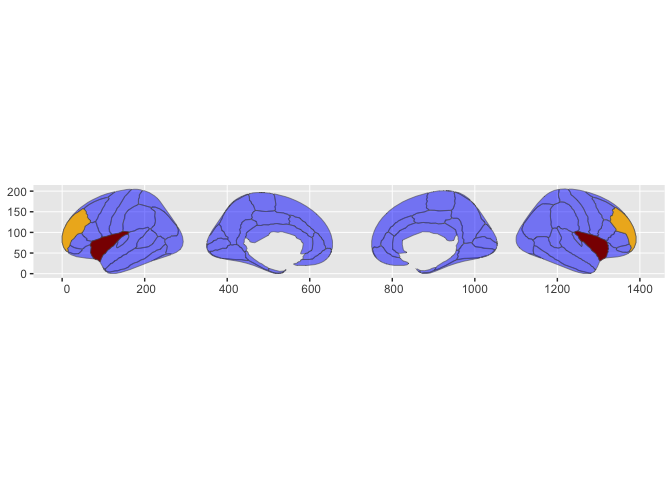

<!-- README.md is generated from README.Rmd. Please edit that file -->

# ggbody

<!-- badges: start -->

<!-- badges: end -->

ggbody uses corporal atlases (curated in fantastic packages like ggseg
and gganatogram) and experiments with APIs like those in ggfips (us
counties) and ggnc (north carolina). That is, position aesthetic is
specified (lobe/seg/tissue) via an aes(region = .) call, which will join
up the atlas polygons in the background via the ggplot compute
mechanisms. This allows flat files without region perimeter information
to be used as the data frame input.

In addition, there are stamp functions which allow geometries to be
accessed without referring to any dataframe at all, but by the name of
the region (or meta or sub region).

## Installation

You can install the development version of ggbody from
[GitHub](https://github.com/) with:

``` r
# install.packages("devtools")
devtools::install_github("EvaMaeRey/ggbody")
```

## Example

This is a basic example which shows you how to solve a common problem:

``` r
library(tidyverse)
#> ── Attaching core tidyverse packages ──────────────────────── tidyverse 2.0.0 ──
#> ✔ dplyr     1.1.0     ✔ readr     2.1.4
#> ✔ forcats   1.0.0     ✔ stringr   1.5.0
#> ✔ ggplot2   3.4.1     ✔ tibble    3.2.0
#> ✔ lubridate 1.9.2     ✔ tidyr     1.3.0
#> ✔ purrr     1.0.1     
#> ── Conflicts ────────────────────────────────────────── tidyverse_conflicts() ──
#> ✖ dplyr::filter() masks stats::filter()
#> ✖ dplyr::lag()    masks stats::lag()
#> ℹ Use the conflicted package (<http://conflicted.r-lib.org/>) to force all conflicts to become errors
library(ggbody)
## basic example code

library(ggplot2)

set.seed(12345)
dk_flat %>% 
  slice_sample(n = 5)
#>    hemi    side                 region                   label  roi
#> 1  left lateral             precentral           lh_precentral 0025
#> 2 right lateral  lateral orbitofrontal rh_lateralorbitofrontal 0013
#> 3 right  medial    posterior cingulate   rh_posteriorcingulate 0024
#> 4  left  medial                 cuneus               lh_cuneus 0006
#> 5 right lateral rostral middle frontal rh_rostralmiddlefrontal 0028

set.seed(12345)
dk_flat %>% 
  slice_sample(n = 5) %>% 
  mutate(id = row_number()) %>% 
 ggplot() +
 aes(region = region, fill = id) +
 stamp_dk_brain() + 
 geom_dk_brain(alpha = .5)
#> Joining with `by = join_by(region)`
```


``` r
ggplot() + 
  stamp_dk_brain(fill = "blue")
```


``` r

ggplot() +
  stamp_dk_brain(alpha = .5, fill = "blue") +
  stamp_dk_brain(hemi = "left", fill = "grey") +
  stamp_dk_brain(side = "lateral", hemi = "right", fill = "green") +
  stamp_dk_brain(region = "insula", fill = "darkred")
```


``` r


ggplot() +
  stamp_dk_brain(alpha = .5, fill = "blue") +
  stamp_dk_insula(fill = "darkred") + 
  stamp_dk_rostral_middle_frontal(fill = "goldenrod2")
```



``` r


ggplot() +
  stamp_dk_brain() +
  stamp_dk_side_lateral(fill = "cornflowerblue") +
  stamp_dk_insula(fill = "darkred") + 
  stamp_dk_rostral_middle_frontal(fill = "goldenrod2")
```

 \#
issues

fill aesthetic cannot be character/factor/TF

``` r
dk_flat %>% 
  slice_sample(n = 5) %>% 
  mutate(id = LETTERS[1:5]) %>% 
 ggplot() +
 aes(region = region, fill = id) +
 stamp_dk_brain(aes(fill = NULL, region = NULL)) +
 geom_dk_brain(alpha = .5)
#> Joining with `by = join_by(region)`
#> Error in if (type == "point") {: argument is of length zero


dk_flat %>% 
  slice_sample(n = 5) %>% 
  mutate(id = LETTERS[1:5] %>% as.factor()) %>% 
 ggplot() +
 aes(region = region, fill = id) +
 stamp_dk_brain(aes(fill = NULL, region = NULL)) +
 geom_dk_brain(alpha = .5)
#> Joining with `by = join_by(region)`
#> Error in if (type == "point") {: argument is of length zero

dk_flat %>% 
  slice_sample(n = 5) %>% 
  mutate(id = sample(c(F,T),size = 5, replace = T)) %>% 
 ggplot() +
 aes(region = region, fill = id) +
 stamp_dk_brain(aes(fill = NULL, region = NULL)) +
 geom_dk_brain(alpha = .5)
#> Joining with `by = join_by(region)`
#> Error in if (type == "point") {: argument is of length zero
```
