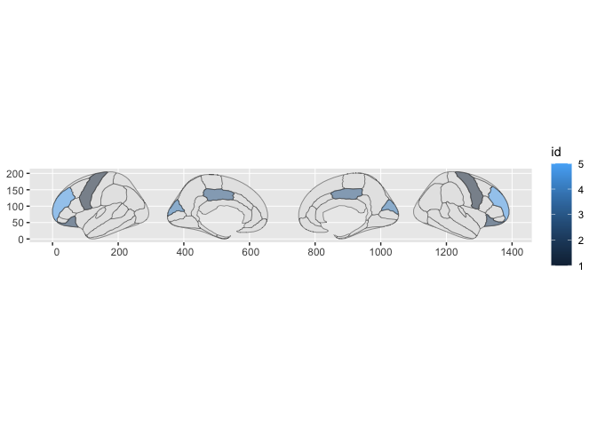

<!-- README.md is generated from README.Rmd. Please edit that file -->

# ggbody

<!-- badges: start -->

<!-- badges: end -->

ggbody uses corporal atlases (curated in fantastic packages like ggseg
and gganatogram) and experiments with APIs like ggfips (us counties) and
ggnc (north carolina). That is, the aesthetic ‘where’ is the name of the
region and flat files without region perimeter information can be used
as the data frame input.

## Installation

You can install the development version of ggbody from
[GitHub](https://github.com/) with:

``` r
# install.packages("devtools")
devtools::install_github("EvaMaeRey/ggbody")
```

## Example

This is a basic example which shows you how to solve a common problem:

``` r
library(tidyverse)
#> ── Attaching core tidyverse packages ──────────────────────── tidyverse 2.0.0 ──
#> ✔ dplyr     1.1.0     ✔ readr     2.1.4
#> ✔ forcats   1.0.0     ✔ stringr   1.5.0
#> ✔ ggplot2   3.4.1     ✔ tibble    3.2.0
#> ✔ lubridate 1.9.2     ✔ tidyr     1.3.0
#> ✔ purrr     1.0.1     
#> ── Conflicts ────────────────────────────────────────── tidyverse_conflicts() ──
#> ✖ dplyr::filter() masks stats::filter()
#> ✖ dplyr::lag()    masks stats::lag()
#> ℹ Use the conflicted package (<http://conflicted.r-lib.org/>) to force all conflicts to become errors
library(ggbody)
## basic example code

library(ggplot2)
c("fusiform",
"inferior parietal" ,
"insula", "precentral"
) %>% tibble(my_region = .) %>%
 mutate(value = 1:4) %>%
 mutate(name = letters[1:4] %>% as.factor()) %>%
 ggplot() +
 aes(region = my_region, fill = value) +
 geom_sf(data = ggseg::dk$data,
         aes(region = NULL, fill = NULL) # huh?  required?
 ) +
 geom_sf_brainsegs(alpha = .5)
#> Joining with `by = join_by(region)`
```



``` r
ggplot() + 
  stamp_sf_brainsegs(fill = "blue")
```


``` r


ggplot() +
  stamp_sf_brainsegs(alpha = .5, fill = "blue") +
  stamp_sf_brainsegs(hemi = "left", fill = "black") +
  stamp_sf_brainsegs(side = "lateral", hemi = "right", fill = "green") +
  stamp_sf_brainsegs(region = "insula", fill = "pink")
```


